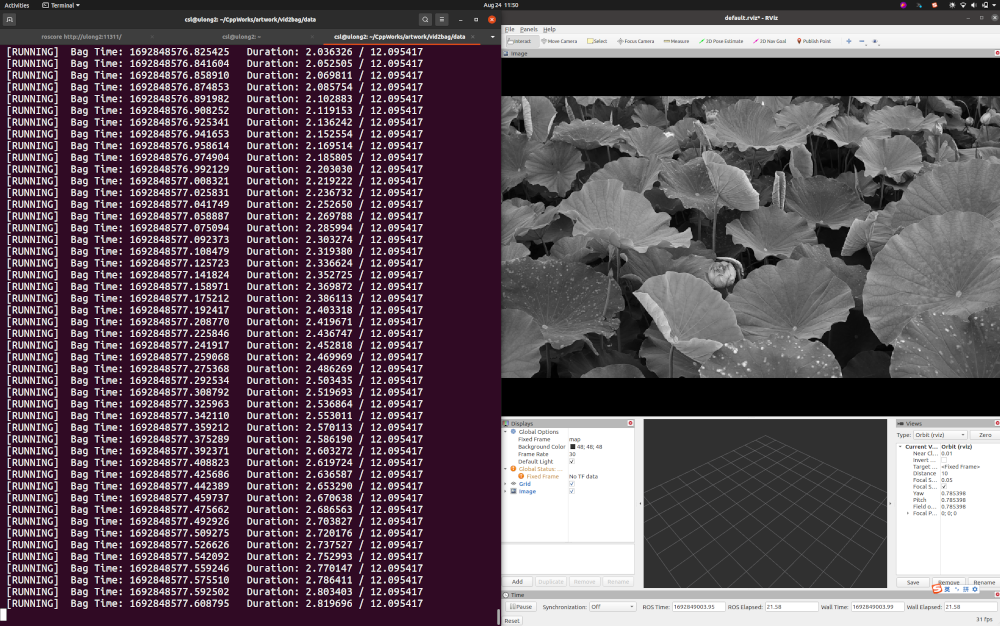

# vid2bag/vid2img: convert a video to a rosbag/separate images

# Author

***Name: Shuolong Chen (ULong2) from WHU (Wuhan University)***

***E-Mali: shlchen@whu.edu.cn***

# Usage

```sh
Usage: rosrun vid2bag vid2bag [--help] [--version] [--output VAR] [--scale VAR] [--gray] video

Positional arguments:
  video          the path of the video 

Optional arguments:
  -h, --help     shows help message and exits 
  -v, --version  prints version information and exits 
  -o, --output   the path of the rosbag to output [default: ""]
  -s, --scale    the scale rate of image frames, range: (0.0, 1.0] [default: 1]
  -g, --gray     convert color images to gray ones if they are
```


```shell
Usage: rosrun vid2bag vid2bag [--help] [--version] [--output VAR] [--scale VAR] [--gray] video

Positional arguments:
  video          the path of the video 

Optional arguments:
  -h, --help     shows help message and exits 
  -v, --version  prints version information and exits 
  -o, --output   the folder path to output images [default: ""]
  -s, --scale    the scale rate of image frames, range: (0.0, 1.0] [default: 1]
  -g, --gray     convert color images to gray ones if they are 
```


# Functions
+ **convert a video to a rosbag**
<div align=center></div>

+ **convert color image frames to gray ones (optional)**
<div align=center></div>

+ **scale image frames when converting (optional), scale is 0.05 in the below example.**
<div align=center></div>

